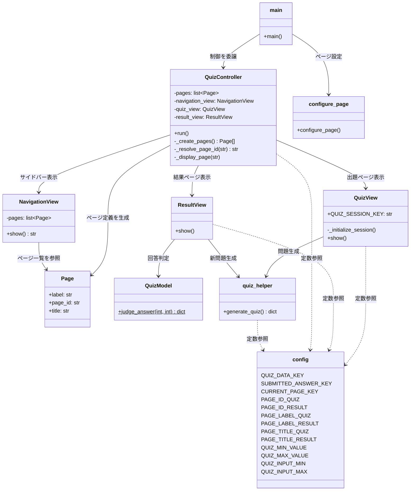
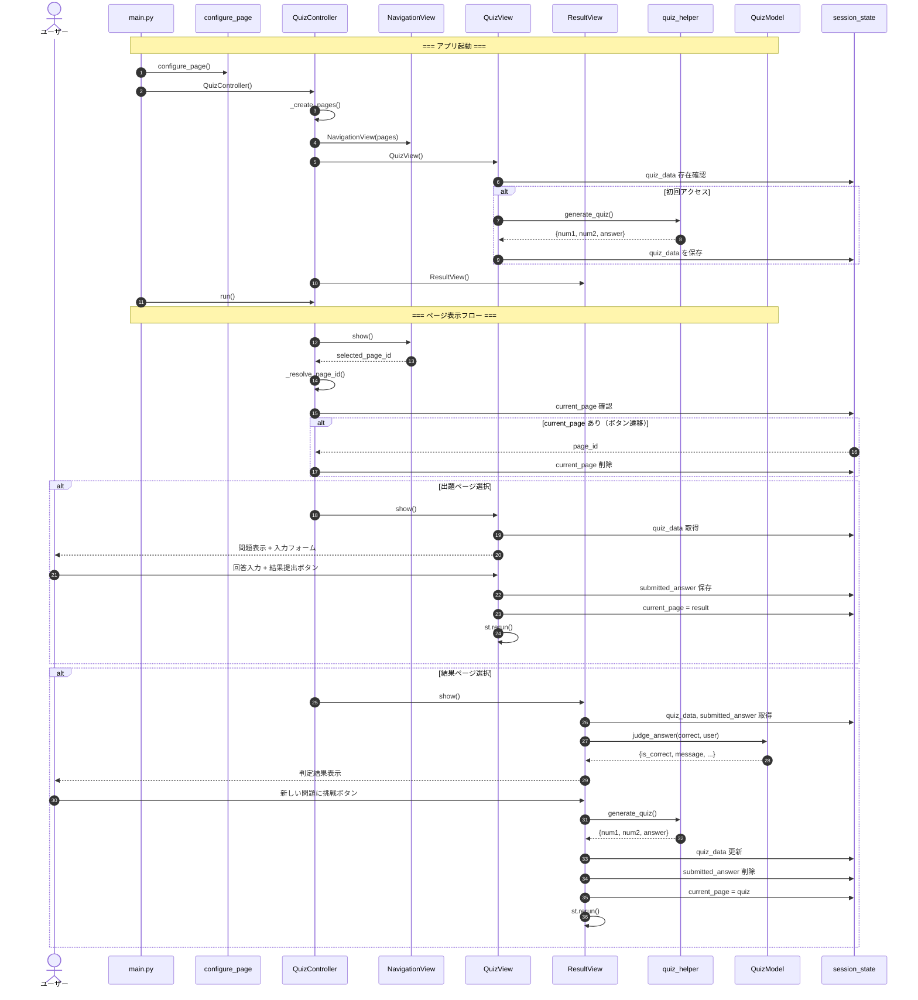

# MVC_GUI_Practice_with_Copilot - アーキテクチャドキュメント

## 概要

1桁の正の整数の足し算クイズアプリケーション。  
MVCアーキテクチャパターンに基づき、Streamlit で構築されています。

---

## プロジェクト構成

```
MVC_GUI_Practice_with_Copilot/
├── main.py                    # アプリケーション起点
├── config.py                  # 共通定数管理
├── models/
│   ├── __init__.py
│   └── quiz_model.py          # QuizModel（判定ロジック）
├── views/
│   ├── __init__.py             # Views層パッケージ（公開API一元管理）
│   ├── configure_page.py       # ページ設定
│   ├── page.py                 # Page（値オブジェクト）
│   ├── navigation_view.py      # NavigationView（サイドバー）
│   ├── quiz_view.py            # QuizView（出題画面）
│   ├── result_view.py          # ResultView（結果画面）
│   └── quiz_helper.py          # 問題生成の共通処理
├── controllers/
│   ├── __init__.py
│   └── quiz_controller.py      # QuizController（フロー制御）
└── requirements.txt
```

---

## クラス関係図



### 関係の種類

| 記号 | 意味 |
|------|------|
| 実線矢印（→） | 直接的な依存（インスタンス保持・メソッド呼び出し） |
| 点線矢印（..>） | 定数参照のみの間接的な依存 |

---

## シーケンス図



### フェーズ説明

| フェーズ | ステップ | 内容 |
|----------|----------|------|
| アプリ起動 | 1〜11 | main → Controller → 各View初期化 |
| ページ表示フロー | 12〜16 | ナビゲーション表示 → ページ遷移解決 |
| ユーザー操作 | 17〜30 | 出題 ↔ 結果 の循環フロー |

---

## 各層の責務

### Model層（models/）

| クラス | 責務 |
|--------|------|
| `QuizModel` | 回答の正誤判定（静的メソッド） |

- UIに依存しない独立した層
- 純粋なビジネスロジックのみ

### View層（views/）

| クラス/モジュール | 責務 |
|-------------------|------|
| `Page` | ページ定義の値オブジェクト |
| `NavigationView` | サイドバーのナビゲーション表示 |
| `QuizView` | 足し算問題の出題と入力フォーム |
| `ResultView` | 判定結果の表示と再チャレンジ |
| `quiz_helper` | 問題生成の共通処理 |
| `configure_page` | Streamlitページ設定 |

- ビジネスロジックを持たない
- UI表示のみを担当

### Controller層（controllers/）

| クラス | 責務 |
|--------|------|
| `QuizController` | ページ定義管理、Views協調、ページ遷移制御 |

- ModelとViewの仲介
- アプリケーション全体のフロー統括

### 共通モジュール

| モジュール | 責務 |
|------------|------|
| `config.py` | session_stateキー、ページID/ラベル/タイトル、クイズ設定の定数管理 |

---

## 設計原則

| 原則 | 適用箇所 |
|------|----------|
| 単一責任原則（SRP） | 各クラスが1つの責務のみを持つ |
| YAGNI原則 | 現在必要な機能のみ実装 |
| オープン・クローズド原則（OCP） | 新ページ追加時に既存クラスを修正しない |
| DRY原則 | quiz_helper で問題生成を共通化 |
| 高凝集・疎結合 | MVCの各層が独立し、config で定数を一元管理 |
